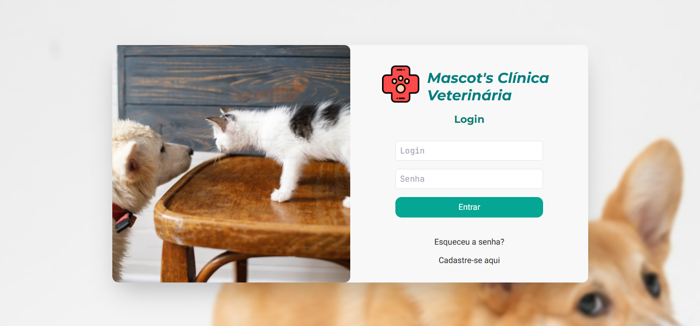
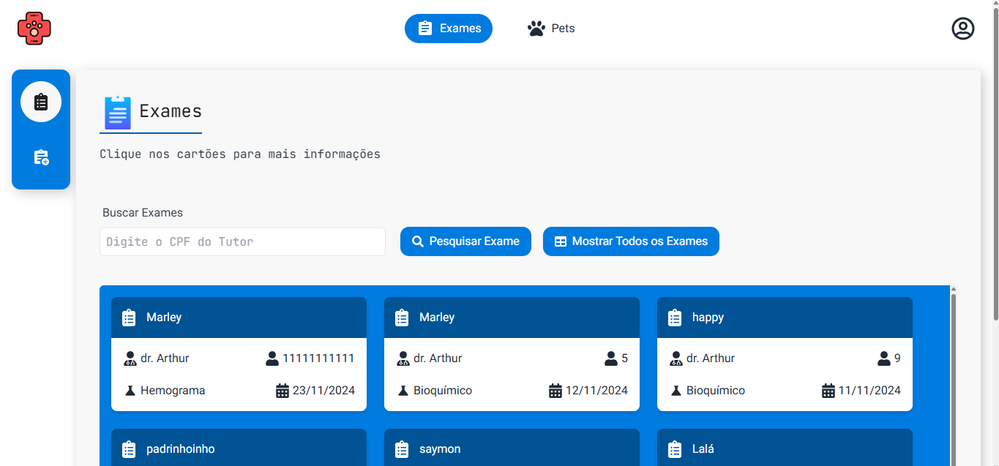
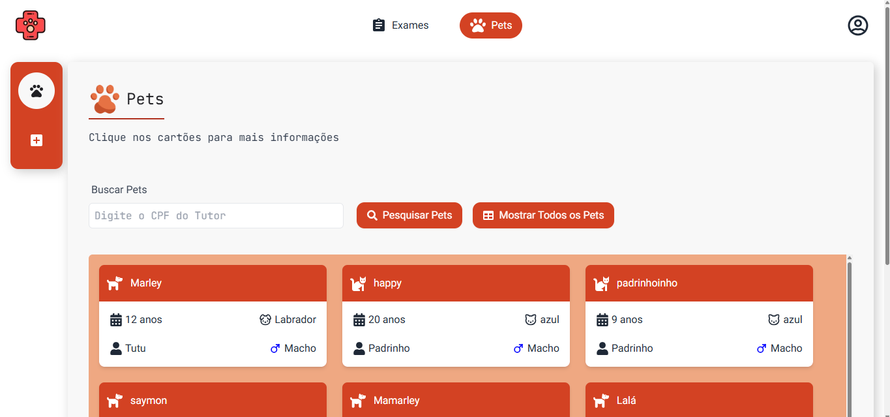

# Mascots Clínica Veterinária

Automatize o processo de cadastro de pets e a prescrição de exames com a plataforma **Mascots**. Desenvolvida para simplificar e organizar as operações em clínicas veterinárias, nossa solução visa eficiência e facilidade no gerenciamento de informações.

---

## 🐾 **Sobre o Projeto**

A **Mascots** foi criada como parte do programa da **SOFTEX Pernambuco**. Nosso objetivo é proporcionar uma experiência moderna e prática para profissionais da área veterinária, tutores e seus pets.

### 📋 **Funcionalidades**

- Cadastro de pets e tutores de forma prática e intuitiva.
- Gerenciamento de dados de tutores e pets.
- Prescrição de exames com informações completas.
- Seleção de veterinários e emissão de relatórios.

---

## 🚀 **Tecnologias Utilizadas**

- **Frontend:** [Next.js](https://nextjs.org/), TypeScript, Tailwind CSS.
- **Backend:** Integrações simuladas e uso de `localStorage` para persistência.
- **Bibliotecas:** `uuid`, `faker`, e outras para geração de IDs e dados.

---

### Detalhes:

- **Visual amigável:** Use emojis para tornar o conteúdo mais atraente.
- **Sessões claras:** Divida o README em partes compreensíveis.
- **Markdown bem utilizado:** Cabeçalhos, listas e código foram organizados de forma legível.

---

## 📸 **Screenshots**

🐶 Tela de login

📋 Tela de visualiação de exames

🐾 Tela de visualização de pets cadastrados

